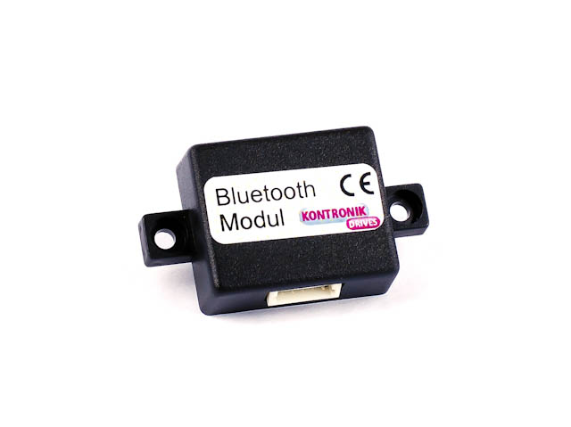
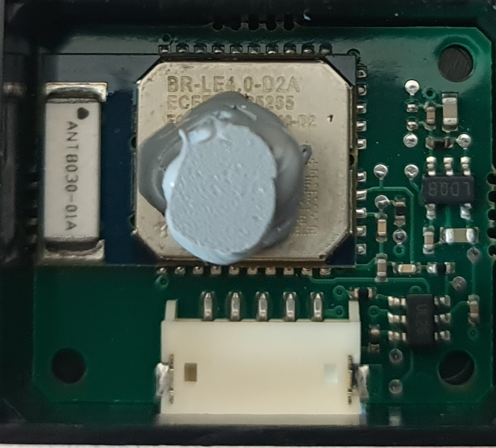
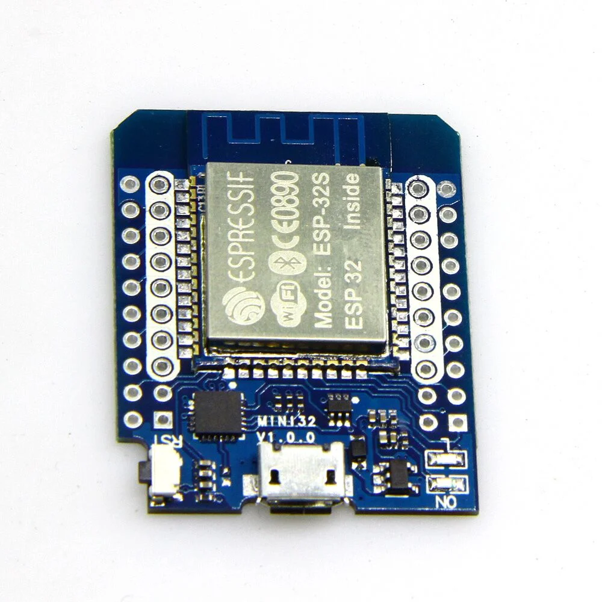
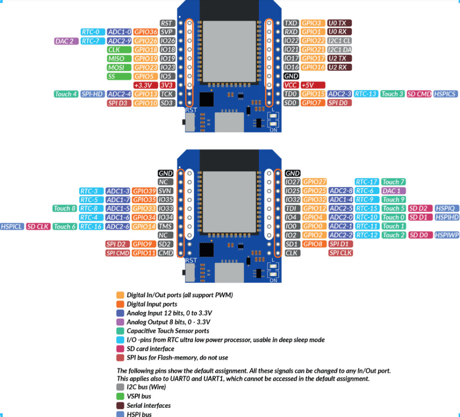
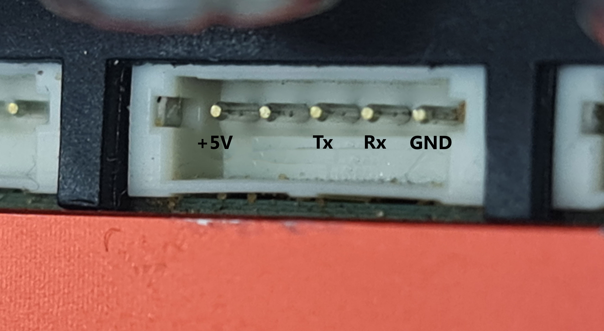
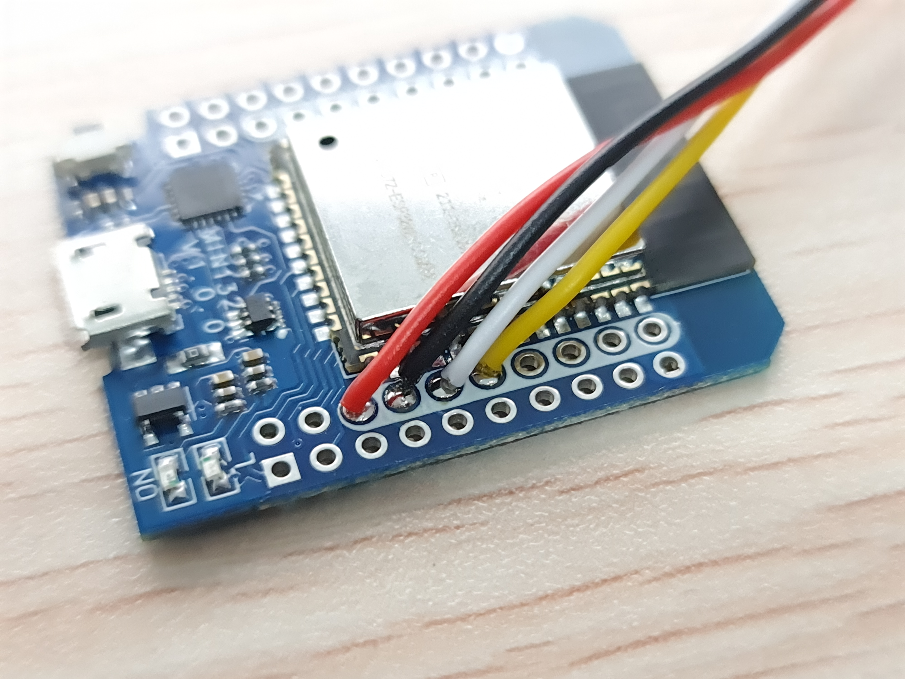
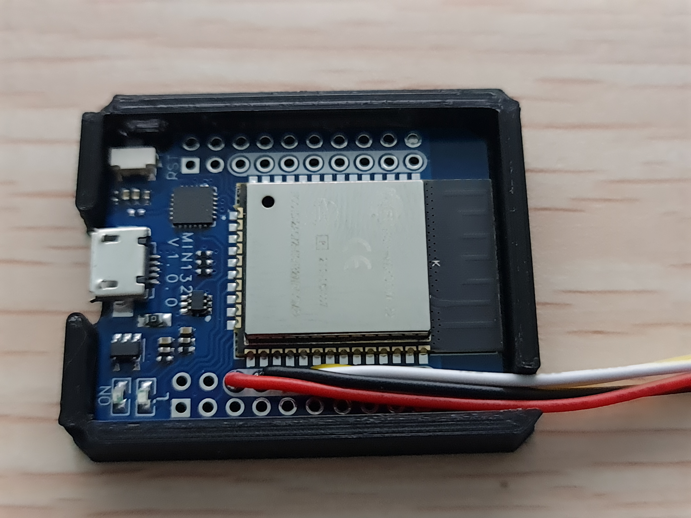
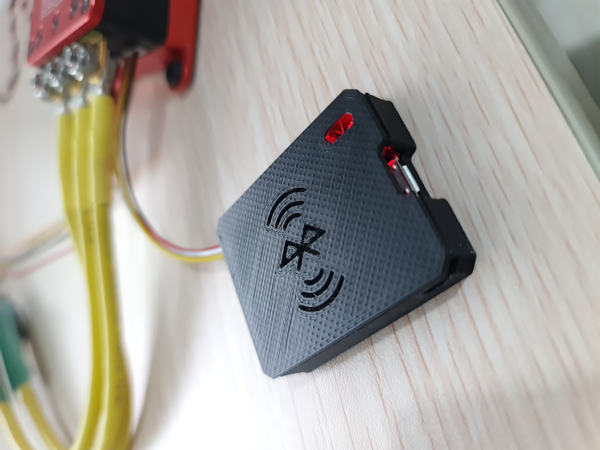
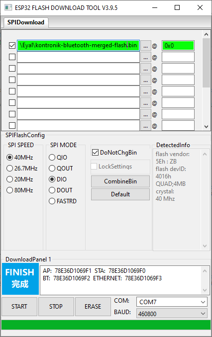

| Supported Targets | ESP32 |
| ----------------- | ----- |

# KONTRONIK Bluetooth Module



The Bluetooth module is an interface between the ESC and Android or Apple smartphone.
Since Kontronik stopped to maintain those apps, they're not supported by the latest Android/Iphone versions.


## Background 
The Kontronik ESCs (Kosmik and Jive pro) are utilizing a full duplex 8 bit 115200 1 stop bit no parity 3.3v UART communication via the JST-ZH1.5 5 pin connector.
The original Kontronik module is built on top of Blue Radios [BR-LE4.0-D2A](https://www.blueradios.com/hardware_LE4.0-D2.htm) bluetooth module. 

<p align="center"><br>
  <i>Kontronik Bluetooth Module</i><br><br></p>

The ESC uses the built in module AT commands to check the presens of the bluetooth module.
Once the module reply to those commands the ESC starts sending data and telemetry.

On the boot phase, the ESC sends 3 AT commands and wait for response from the module.
* +++\r <br> response: \r\n
* AT\r <br> response: \r\nOK\r\n
* ATSN?\r <br> response: \r\nOK\r\n\r\nKONTRONIKBT\r\n

more information can be found on the AT command documetation by BlueRadios

### Hardware Required

The code can be run on any development board, that is based on the Espressif ESP32 SoC with classic Bluetooth capabilities. The board can be connected to a computer with a single USB cable for flashing and monitoring.
I choosed the ESP32 D1 mini board as this was the smallest option.

<p align="center"><br>
  <i>ESP32 D1 Mini</i><br><br></p>

[Link to Aliexpress](https://www.aliexpress.com/item/1005001621844145.html?spm=a2g0o.order_list.order_list_main.5.f2f71802LvbaSD)

### Setup the Hardware

Connect the Kontronik serial interface to the board as follows.

```
 --------------------------------------------
 | Default ESP Pin      | Kontronik Pin     |
 |----------------------|--------------------
 | GPIO16 (Rx)          | Tx                |
 | GPIO17 (Tx)          | Rx                |
 | GND                  | GND               |
 --------------------------------------------
```

<p align="center"><br>
  <i>ESP32 Pinout</i><br><br></p>


### ESC Pinout

<p align="center"><br>
  <i>5 pin JST-ZH1.5mm connector</i><br><br></p>

### Wiring
I used pre-crimped cable that I found on [aliexpress](https://www.aliexpress.com/item/1005004501408268.html?spm=a2g0o.order_list.order_list_main.28.649f1802pr3IIJ) and then the soldering is a quite simple thing.
<p align="center"><br>
  <i>Wiring</i><br><br></p>


### Final Result

I've used an existing design from [thingiverse](https://www.thingiverse.com/thing:6060421) to print a case that fit perfectly to this esp32 board and this is the result.

<p align="center"><br>
  <i>Inside the case</i><br><br></p>
  
<p align="center"><br>
  <i>3D printed case</i><br><br></p>

### Flashing precompiled version
for simplicity purposes, there's a precompiled binary file that can be flashed very easily.

* Download the esp-flashing-tool from [here](https://www.espressif.com/en/support/download/other-tools)
* Connect the ESP32 board to your pc with micro usb cable
* Open the esp-flashing-tool and select the "kontronik-bluetooth-merged-flash.bin" from the bin folder
* Click Start and wait for compleation.
* Recycle the power by disconnection and reconnection the usb cable 

<p align="center"><br>
  <i>esp-flashing-tool</i><br><br></p>


## How to use
* Connect the 5-pin JST connector to the ESC
* power up the ESC
* Search for KONTRONIKBT bluetooth device on your phone
* The code for binding is 1234
* Now you can use the Adroid/Iphone application


### Configure the project

Use the command below to configure project using Kconfig menu as showed in the table above.
The default Kconfig values can be changed such as: KONTRONIK_UART_BAUD_RATE, KONTRONIK_UART_PORT_NUM (Refer to Kconfig file).
```
idf.py menuconfig
```

### Build and Flash

Build the project and flash it to the board, then run monitor tool to view serial output:

```
idf.py -p PORT flash monitor
```

(To exit the serial monitor, type ``Ctrl-]``.)

See the Getting Started Guide for full steps to configure and use ESP-IDF to build projects.


## Troubleshooting

You are supposed to see the echo in the terminal which is used for flashing and monitoring.
